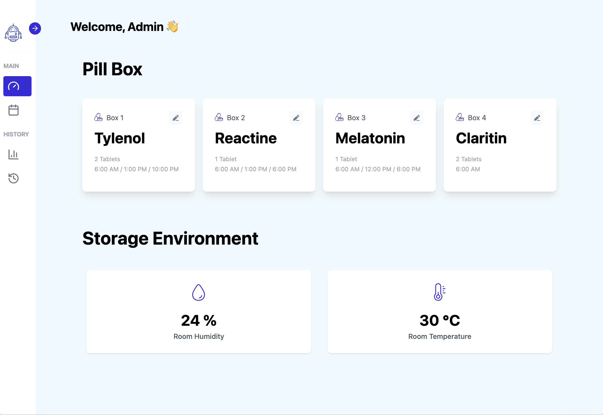
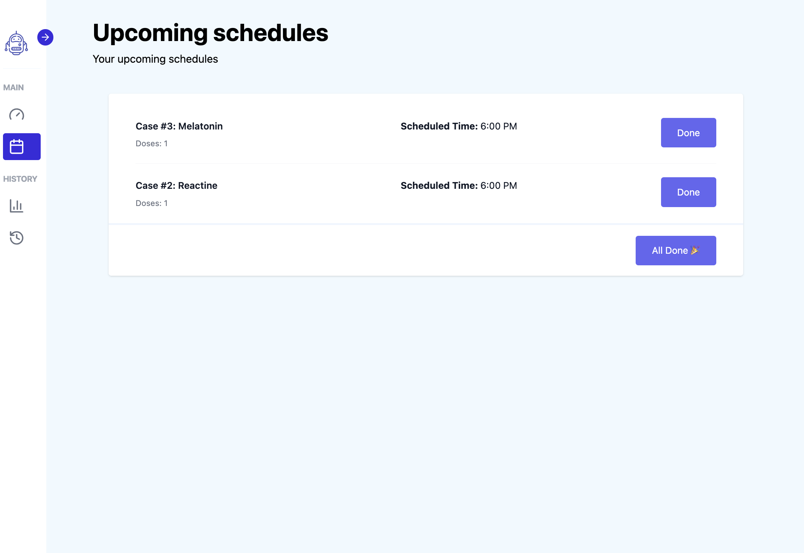
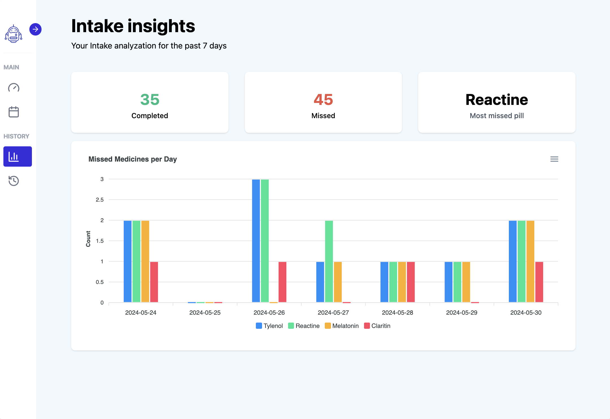
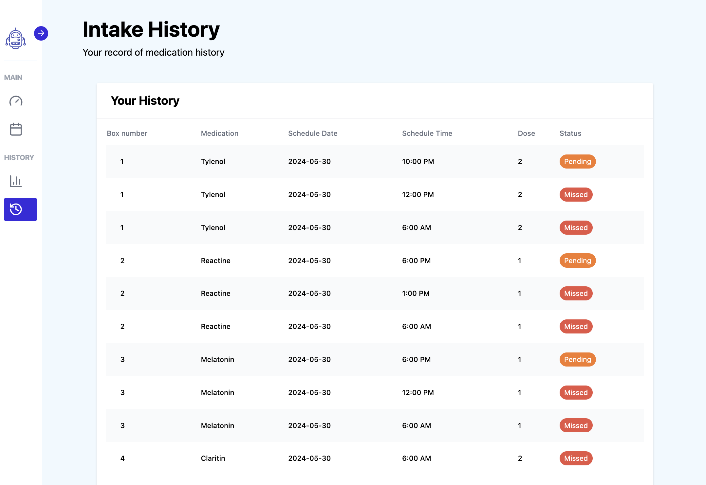
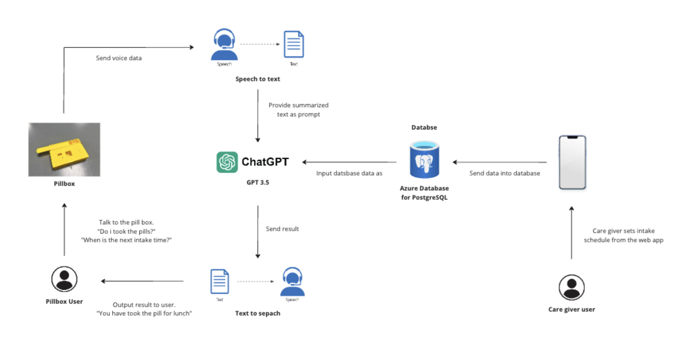
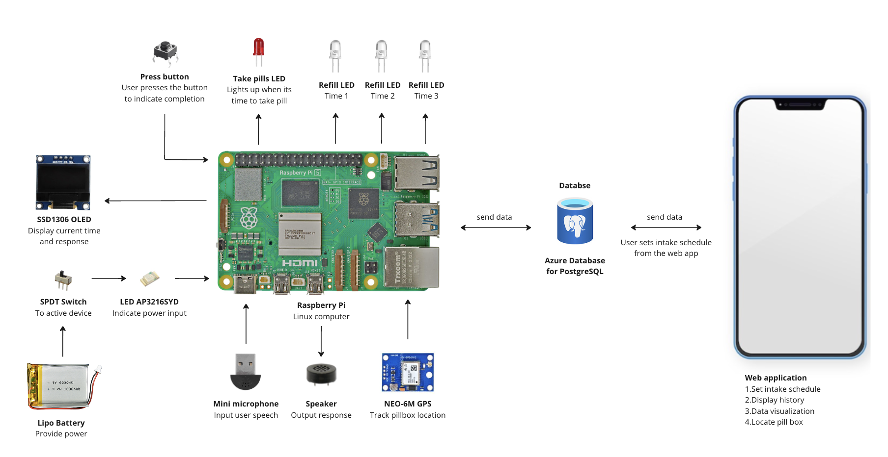
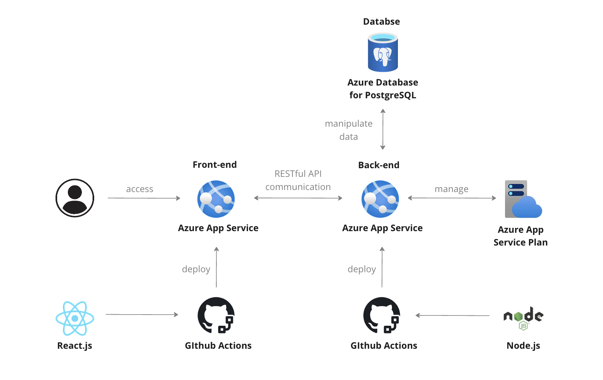

# Medibox

## 🙋 Problem

**Medication adherence** is a significant challenge in the realm of healthcare, and **satisfactory solutions are lacking.**

## 🌟 Solution

We aim to develop a **smart, automated assistant for medication management** to help individuals in effectively managing and adhering to their medications and supplements. Our prioritized user requirements are as follows

1. Visual Reminder
   - Monitor
   - Responsive Web Application
2. Voice Interaction
   - Raspberry Pi with OpenAI API
   - Microphone sensor
   - Speech to Text Machine Learning
3. Tracking of Pill intake History
   - Data visualization
   - Cloud Storage

---

## 📖 Table of Contents 📖

1. [User Interfaces](##user-Interfaces)
2. [Workflow](##workflow)
3. [Hardware design](##hardware-design)
4. [Software design](##software-design)
5. [Getting started](##getting-started)
6. [Team members](##team-members)

---

## User Interfaces

- Dashboard
  
- Upcoming schedules
  
- Data visualizations
  
- Intake history
  

## Workflow



## Hardware Design



## Software Design



## Getting started

#### Prerequisites

1. Install [Node.js](https://nodejs.org/en/download/)
2. Install [npm](https://www.npmjs.com/get-npm)
3. Install depenencies for frontend and backend respectively.
   Frontend:
   ```
   cd frontend/; npm install
   ```
   Backend:
   ```
   cd backend/; npm install
   ```

#### Run app (dev mode)

1. Run the backend server
   ```
   npm run dev
   ```
2. Run the frontend server
   ```
   yarn dev
   ```

## Team members

<div class="photos" style="display: inline-block;
  position: relative;
  width: 50px;
  height: 50px;
  overflow: hidden;
  border-radius: 50%;">
    <a href="https://github.com/xchen83">
    
    </a>
</div>
<div class="photos" style="display: inline-block;
  position: relative;
  width: 50px;
  height: 50px;
  overflow: hidden;
  border-radius: 50%;">
    <a href="https://github.com/yinyin13">
    
    </a>
</div>
<div class="photos" style="display: inline-block;
  position: relative;
  width: 50px;
  height: 50px;
  overflow: hidden;
  border-radius: 50%;">
    <a href="https://github.com/chelsey0527">
    
    </a>
</div>
