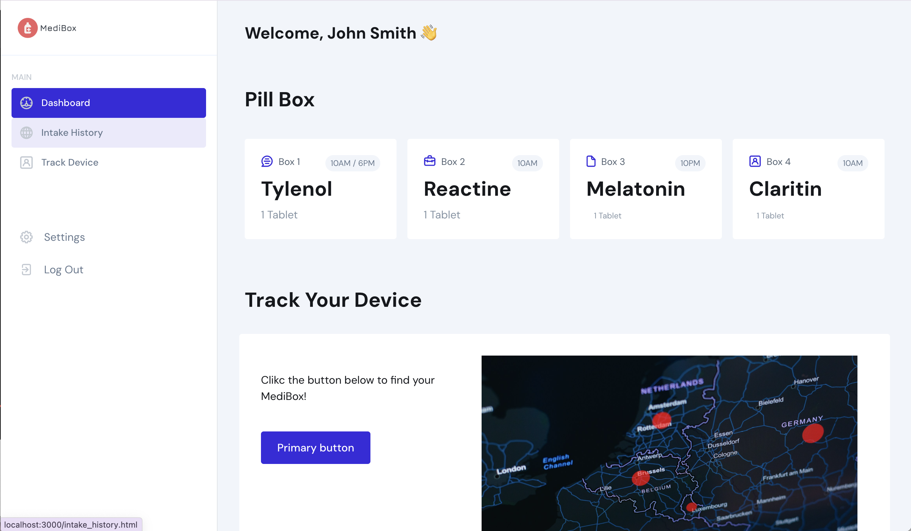

# Smart pill box

## Introduction
Medication adherence is a significant challenge in the realm of healthcare. Non-adherence can lead to consequences such as ineffective treatment, deteriorated health conditions, etc. Despite this obvious problem, satisfactory solutions are lacking. Traditional pill dispensers lack the capabilities to help individuals in accurately managing their medications.

**Therefore, with this project, we aim to develop a smart pill dispenser to help individuals in effectively managing and adhering to their medications and supplements.**

## Table of Contents  
- UI
- workflow
- hardware design
- software design

## UI 

## Workflow

## Hardware Design

## Software Design

